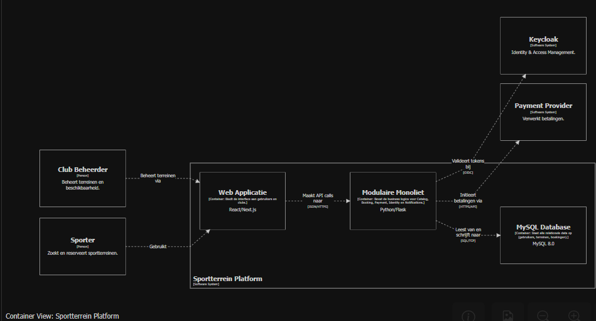
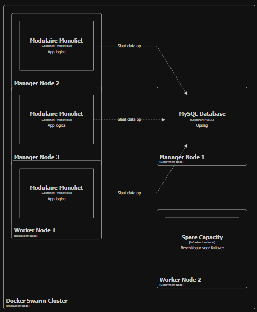

# **Projectopdracht ICT Architecture**
Groepsleden (2ITAI1):
- Louis Boulez (157941)
- Jonas Lemmens (159672)
- Angeles Osier (144610)
- Hajar Takhrifa (163393)
- Viktor Van Deun (159049)

# Opgave
"Veronderstel in de eerste plaats dat de afgestudeerde versie van je team deze opdracht productieklaar moet maken op een half jaar tijd. In je ADR's kan je vermelden welke beslissingen anders zouden zijn als je team en je budget groter / kleiner waren. Voor de vraag "wat de klant waarschijnlijk belangrijk vindt" kijk je naar de gegeven voorbeelden.<br>
**Je klant wil een platform bouwen voor het reserveren van sportterreinen (tennis, padel, voetbal). Gebruikers moeten beschikbare tijdslots kunnen bekijken en betalen. Clubs moeten hun eigen beschikbaarheid kunnen beheren. Vergelijkbare voorbeelden zijn Playtomic.**"

# Karakteristieken [1]
De 7 belangrijkste karakteristieken van de applicatie worden in de tabel hieronder beschreven. Hierna volgt een korte beschrijving per karakteristiek.
|Nr.|Karakteristiek|Expliciet?|Top3|
|:---:|:---------------:|:----------:|:-----:|
|1|Securability|Nee|Ja|
|2|Availability|Ja|Ja|
|3|Integrity|Nee|Ja|
|4|Reliability|Nee|Nee|
|5|Responsiveness|Ja|Nee|
|6|Usability|Ja|Nee|
|7|Scalability|Nee|Nee|

**Securability**<br>
De applicatie gaat met persoonlijke gegevens van gebruikers en betalingsgegevens in contact komen. De gebruikers zijn zowel de sporters (die de terreinen huren) als de clubs en verenigingen. Als er een leak gebeurt, dan verliest onze klant alle vertrouwen van het publiek en faalt de hele business. Dit maakt de beveiliging van gegevens en autorisatie de belangrijkste karakteristiek van het project.

**Availability**<br>
Gebruikers moeten 24/7 kunnen boeken. Terreineigenaars moeten ook 24/7 een rooster kunnen vinden van alle uitgehuurde tijdslots om verwarring te voorkomen. De applicatie moet streven naar altijd online te zijn met zo min mogelijke storingen voor updates of andere redenen.

**Integrity**<br>
Boekingen van terreinen moeten alleen maar gedaan worden door 1 gebruiker. Dubbele boekingen leiden tot ongewilde chaos en verdriet. Het reserveren van terreinen en tijdslots moet integraal werken om te voorkomen dat er iets misloopt. De applicatie moet ervoor zorgen dat al verhuurde terreinen niet opnieuw verhuurd kan worden - ook wanneer er twee pogingen op een korte termijn gebeuren.

**Reliability**<br>
Wanneer het gaat over het managen van tijdslots en terreinen, is betrouwbaarheid belangrijk. Reservaties moeten verwerkt worden op een betrouwbare manier. Wanneer een boeking wordt betaald, dan moet dat terrein tijdens die tijdslot effectief vrij zijn. 

**Responsiveness**<br>
Wanneer een terrein wordt aangemaakt of gehuurd, moet het systeem alles kunnen processen op een snelle termijn. Anders kunnen klanten bij het huren tijdslots zien die eigenlijk niet open zijn. Dit kan planningen storen van die gebruikers.

**Usability**<br>
Gebruikers willen liefst gemakkelijk te begrijpen interfaces. Het huren van terreinen en tijdslots kan al verwarrend zijn, dus het is best om het eenvoudig te houden voor alle leeftijden. Ook moeten clubs gemakkelijk kunnen zien wat uitgehuurd is en wanneer door eenvoudige interfaces.

**Scalability**<br>
Reservaties voor terreinen kunnen piekmomenten hebben zoals tijdens weekends of vlak na normale werkuren of bij een nieuwe seizoen van een sport. De applicatie moet schaalbaar zijn en gereed zijn voor veel traffic tijdens bepaalde momenten. Meer en meer clubs en verenigingen kunnen ook klanten worden met hoe meer vertrouwen er in de applicatie is. 

# Logische Componenten
## Actor/action
**Gebruiker**
- Inloggen
- Beschikbare terreinen zoeken/kiezen
- Beschikbare tijdslot kiezen
- Reservatie bevestigen
- Boeking betalen
- Reservatie annuleren
- Reservaties bekijken
- Eigen account beheren

**Club(beheerder)**
- Inloggen
- Clubgegevens beheren
- Terreingegevens beheren
- Reservaties bekijken
- Terrein toevoegen/verwijderen
- Open tijdsloten aanpaassen

**Systeem**
- Notificaties/bevestigingsmails sturen
- Betalingen verwerken
- Beschikbare tijdslot na een reservatie/annulering updaten

## Workflow
**Workflow 1:**<br>
De gebruiker boekt een veld:
```
Inloggen → Terrein zoeken en kiezen → Tijdslot kiezen → Betalen
```
**Workflow 2:**<br>
De club(beheerder) stelt zijn club in:
```
Inloggen → Terrein toevoegen → Informatie invullen → Open tijdslots toevoegen → Boekingen bekijken
```

## De logische componenten
Uit de vorige analyses stellen we de volgende logische componenten vast:

1. **Gebruikersbeheer**<br>
   *Taken*:
   - Authenticatie (Veilig inloggen op de juiste account.)
   - Autorisatie (Geschikte rechten hebben voor de accounts.)
   - Beheren van persoonlijke gegevens.
   - Bijhouden van gebruikersgeschiedenis op het platform.

2. **Terreinmanagement**<br>
   *Taken*:
   - Registreren en opslaan van adres.
   - Bekendmaking van open tijdslots.
   - Prijs aanpassen.
   - Gegevens en beschikbaarheid van terreinen aanpassen.

3. **Betalingsverwerking**<br>
   *Taken*:
   - Afhandelen van het betalingsproces.
   - Berekenen van commissies en sturen naar de relevante club.
   - Tijdelijke reservatie veranderen in een echte reservatie na succes van betaling.
   - Annulaties en refunds verwerken.

4. **Boekingsbeheer/Reserveringsafhandeling**<br>
   *Taken*:
   - Plaatsen van een tijdelijke reservatie (hold) op een slot.
   - Veranderen van een hold naar een bevestigde reservatie na geldige betaling.
   - Vrijgeven van verlopen of geannuleerde reservaties.
   - Boekingsgeschiedenis aan de gebruiker tonen.
   - Bezette slots aan clubbeheerders tonen.

5. **Notificatiesysteem**<br>
   *Taken*:
   - Bevestigingsmails sturen.
   - Clubbeheerders notificeren bij boekingen/annulaties.

# Architecturale stijl
We stellen onze ADR's op volgens de Nygard Template [2].

## **ADR 1:** Keuze van architecturale stijl

### Status

Geaccepteerd

### Context
We bouwen een nieuw reserveringsplatform voor tennis-, padel- en voetbalterreinen. Het systeem wordt gebruikt door zowel sporters (die zoeken, reserveren en betalen) als clubbeheerders (die hun terreinen ter beschikking stellen en beschikbaarheden beheren). Het systeem is vergelijkbaar met het reeds bestaande platform Playtomic.

We zijn een team van 5 pas afgestudeerden en de applicatie moet binnen 6 maanden productieklaar zijn. De driving characteristics zijn; integrity, availability, reliability, securability, responsiveness, scalability en usability.

Alle vijf stijlen, die we in de cursus behandelden, werden tegen elkaar afgewogen:
- Gelaagde architectuur
- Modulaire monoliet
- Microkernel
- Microservices
- Event-driven.

### Decision
We kiezen voor een **modulaire monoliet** met vijf subdomeinen: 
- Catalog (sporten, terreinen, clubs)
- Booking (slots en reservaties)
- Payment (transacties en refunds)
- Identity (users, clubs, rollen)
- Notifications (mail, push)

Elk subdomein heeft een duidelijk afgebakende verantwoordelijkheid en communiceert via interne API's. Elke module bezit haar eigen DB-schema in één gedeelde instantie. Verwijzingen tussen modules verlopen via expliciete ID-referenties, niet via cross-schema foreign keys. De applicatie wordt als één unit gedeployed.

Verantwoording:
1. Gelaagde architectuur lijkt niet geschikt vanweze haar beperkte schaalbaarheid. We verwachten domeinwijzigingen (vb. nieuwe sporttype) en pieken in gebruik.
2. Er is geen duidelijk plugins-scenario in dit project. Daarom lijkt microkernel niet geschikt.
3. Een event-driven architectuur is interessant voor specifieke onderdelen, maar is als hoofdstijl te complex voor een team van juniors. 
4. We kozen niet voor microservices omdat dat complexer is voor een klein team van juniors met weinig tijd. Experts zoals Sam Newman en Martin Fowler zeggen ook dat microservices pas zinvol zijn bij grotere teams en systemen [3, 4]. Een modulaire monoliet is eenvoudiger te bouwen en kan later, als het platform groeit, stap voor stap omgezet worden naar microservices. 

### Consequences
#### Positief
- Eenvoudige deployment.
- Makkelijker te testen.
- Reserveren en betalen kunnen samen afgehandeld worden.

#### Negatief
- Als één onderdeel crasht, kan de hele app uitvallen.
- Je kan niet 1 module apart opschalen.

### Alternatives Considered
Bij een groter en/of een ervaringrijker team zouden we de microservices verkiezen. Dat zou ons de maximale scalability geven om enorme pieken op te vangen. 

### Uitbreiding
Binnen elke module van onze modulaire monoliet kunnen we een zogenaamde "Hexagonal Architecture"-patroon toepassen. De domeinlogica wordt op die manier afgeschermd van externe technologie door ports en adapters [5, 6]. Dit kan de nadelen die we in ADR 2 en ADR 3 benoemen (zie verder) verkleinen. Wanneer we wisselen van betaalprovider of identity provider, dan moeten we een nieuwe adapter schrijven i.p.v. de business-logica verbouwen.
# Verdere beslissingen
## **ADR 2:** Authenticatie en autorisatie via OpenID Connect met Keycloak

### Status

Geaccepteerd

### Context
We (een team van 5 pas afgestudeerden) bouwen een modulaire monoliet voor het reserveren van sporttijdslots, waarbij we 'Securability' als belangrijkste karakteristiek ervaren. Het platform heeft drie soorten gebruikers met verschillende rechten:

- Eindgebruikers: boeken slots, betalen, beheren hun eigen profiel
- Clubbeheerders: beheren beschikbaarheid, prijzen en terreinen van hun eigen club
- Platformbeheerders: interne staff voor support en refunds

De klant kan verwachten dat eindgebruikers kunnen inloggen via sociale accounts (Google, Apple), omdat dat in B2C-bookingplatformen een gebruikelijke UX-verwachting is.

We hebben drie opties overwogen:

1. Eigen authenticatiesysteem  bouwen:
- passwords zelf hashen (bcrypt/argon2)
- sessies beheren
- password-resetflows
- OAuth2-server zelf draaien voor third-party integraties.
2. Managed Identity Provider:  Auth0 of AWS Cognito (een betaalde dienst)
3. Een zelf-gehoste open-source oplossing: Keycloak [7], Authelia, ...

### Decision
We kiezen voor OpenID Connect (OIDC) als protocol en **self-hosted Keycloak** als Identity Provider. Onze applicatie beheert zelf geen wachtwoorden (dat doet Keycloak volledig). Eén Keycloak-realm sportbooking bevat drie realm-rollen (end_user, club_admin, platform_admin) en wordt door alle clients (web, mobiel, eventuele toekomstige API-partners) gedeeld.

Authenticatieflows:
- Web en mobiel: Authorization Code Flow met PKCE.
- Sociale login: via Keycloak Identity Brokering, niet rechtstreeks in onze applicatie.

Onze backend controleert bij elk verzoek het JWT-token via Keycloak. Rolcontroles zitten op één centrale plek, niet verspreid door de code.

Verantwoording:
1. Zelf authenticatie bouwen is voor ons team een onnodig risico. Alles moet correct en veilig geïmplementeerd worden, wat veel tijd en ervaring vraagt. De gevolgen van een foutje zijn hier te groot.
2. We vermijden extra kosten door een zelf-gehoste oplossing te verkiezen boven een betalende service.
3. We kiezen om 1 realm te implementeren. Een realm per gebruikerstype zou netter lijken qua scheiding, maar neemt praktische problemen met zich mee. Vb. Een clubbeheerder die ook gewoon wil boeken zou dan twee accounts nodig hebben.

### Consequences
#### Positief
- Sociale logins (Google, Apple) configureren via Keycloak's UI in plaats van per provider eigen code.
- Tweestapsverificatie kan per rol aan- of uitgezet worden.
- Ingebouwde wachtwoordbeleid en accountblokkering
- Onze backend bewaart geen passwords, dus een DB-leak stelt geen credentials bloot.

#### Negatief
- Als Keycloak uitvalt, kan niemand **nieuw** inloggen (bestaande logins blijven werken tot het token vervalt). We kunnen minimum twee Keycloak-instanties draaien om dit op te vangen.
- Extra beheer: Keycloak heeft een eigen database, updates en monitoring nodig.
- Migreren naar een andere identity provider later vereist dat alle gebruikers hun wachtwoord opnieuw instellen.

## **ADR 3:** Kiezen voor een Relationele Database (MySQL)

### Status

Geaccepteerd

### Context

Onze applicatie beheert sterke relaties tussen clubs, hun terreinen, de tijdslots van die terreinen en de gebruikers die aangesloten zijn op die tijdslots via hun eigen reservaties die dan ook gerelateerd zijn met de clubs. Daarnaast is er nood aan relaties tussen de financiële gegevens voor zowel de gebruikers als de clubs.

Hiervoor hebben we een database nodig met de nodige capaciteit om complexe relaties bij te houden en voor hoge data-integriteit. (Dit sluit aan met onze karakteristieken: Integrity en Reliability.)

We bespraken MongoDB omdat we ervaring ermee hebben en omdat boekingen constant veranderen, wat goed werkt met MongoDB (snel veranderende data), maar omdat het niet relationeel is kan het problematisch zijn. We werken met relaties die er als volgt uitzien:

- Elke boeking heeft een gebruiker.
- Elk gebruikt tijdslot heeft een boeking.
- Tijdslots behoren enkel tot hun terrein.
- Terreinen behoren alleen tot 1 club (We negeren voor nu terreinen die gedeeltelijk behoren tot meerdere clubs in een soort beaurocratisch systeem van shareholders.)
- Elke gebruiker en terrein hebben private betalingsgegevens.

### Decision

We kiezen voor MySQL als database. Het is relationeel, dus het zal goed met connecties omgaan, en we hebben al ervaring gehad met MySQL, dus we zullen snel ermee kunnen werken in plaats van de tijd nemen om een andere database te leren.

### Consequences

#### Positief
- Data-integriteit: Dankzij vaste relaties, kunnen tijdslots of boekingen niet ergens rondzweven in het systeem. Elke tijdslot of boeking moet een relatie hebben tot een gebruiker en terrein. Dit kan via `Foreign Keys`. In MongoDB zou data kunnen bestaan zonder relaties.
- Zoekopdrachten: MySQL is enorm geschikt om ermee te zoeken wegens de sterke relaties. Joins maken queries efficiënt en betrouwbaar.

#### Negatief
- Flexibiliteit: Als we fundamenteel iets willen veranderen aan de gegevens, zal dit intensieve datamigraties nodig hebben. Dit is trager dan bij relatie-loze (of schemaloze) databases.

## **ADR 4:** Aantal replica's in productie (n=3) + 1 spare capacity voor beschikbaarheid

### Status

Geaccepteerd

### Context
Om een uptime van 99.9% te halen, mag het systeem geen Single Point of Failure hebben. Als we slechts 1 instantie van de applicatie draaien en deze crasht of loopt vast, dan is het platform down voor alle gebruikers en leidt dit direct tot omzetverlies. Er is een strategie nodig waarbij meerdere instanties tegelijk draaien zodat als er één wegvalt een andere instantie dit kan opvangen.

### Decision
We hebben besloten om standaard **3 replica's** van de modulaire monoliet horizontaal te schalen in het Docker Swarm cluster met 1 spare capacity node. Hierdoor detecteert het systeem automatisch via health checks wanneer een instantie faalt, waarna het verkeer direct wordt omgeleid naar een werkende replica zodat de gebruiker gewoon kan doorgaan.

1.  **Redundantie:** Door 3 replica's te gebruiken, kan er één instantie uitvallen terwijl de andere twee de volledige load blijven opvangen.
2.  **Health Checking & Rerouting:** In combinatie met Docker Swarm worden replica's die vastlopen of gecrashed zijn automatisch gedetecteerd. Het verkeer wordt dan via rerouting onmiddellijk naar de overgebleven gezonde replica's gestuurd.
3.  **Self-healing:** Terwijl de gezonde replica's het verkeer afhandelen, herstart Swarm de gefaalde instantie, waardoor we na korte tijd weer op volledige capaciteit draaien.

### Alternatives Considered
*   **1 Replica:** Geen redundantie; bij elke fout ligt het hele platform plat.
*   **2 Replica's:** Als er één uitvalt, moet de overblijvende instantie plotseling 100% meer verkeer verwerken, wat kan leiden tot een tweede crash. 3 replica's biedt een veiligere marge.
*   **Microservices:** Een modulaire monoliet is 'beginner-friendlier' en vinden we beter passen bij deze opdracht.

### Consequences
#### Positief
* Automatisch herstel van crashes binnen 30-40 seconden zonder dat de gebruiker het merkt.
* Ondersteunt zero-downtime updates, omdat er altijd replica's online blijven terwijl anderen worden bijgewerkt.
* Door bewust 3 replica's op 5 nodes te draaien, behouden we 1 node als 'spare capacity'. Bij een hardwarecrash van een volledige server kan Docker Swarm direct uitwijken naar deze lege node.
#### Negatief
* Iets hogere belasting op de MySQL database wegens de meerdere verbindingen en health checks.
  
## **ADR 5:** Horizontale Scaling via Docker Swarm

### Status

Geaccepteerd

### Context

Het sportterrein-reserveringsplatform verwacht sterk variërend verkeer. Conform de groepsbeslissing in ADR 1 gebruiken we een **Modulaire Monoliet** architectuur. Voor de scalability focussen we op het horizontaal schalen van deze monoliet om de load op het systeem op te vangen.

- **Dagelijkse pieken**: werkdagen tussen 17:00 en 22:00.
- **Seizoensgebonden**: meer boekingen in de zomer.
- **Groei over tijd**: baseline-capaciteit moet meegroeien.

De applicatie moet deze variatie kosten-efficiënt opvangen door de volledige monoliet-instanties op te schalen tijdens pieken.

### Beperkingen

- **Team**: 5 afgestudeerden
- **Tijdsbestek**: half jaar tot productie
- **Opdracht-eis**: POC's via `docker stack deploy`

### Decision

We kiezen voor **horizontale scaling van de modulaire monoliet via Docker Swarm**.

#### Waarom een Modulaire Monoliet voor Scalability?

Hoewel de applicatie als één unit wordt gedeployed, biedt de modulaire opbouw voordelen voor schaalbaarheid:
1.  **Eenvoudige Replicatie**: We kunnen de volledige monoliet (inclusief alle modules zoals Booking, Catalog, etc.) eenvoudig meerdere keren draaien. Swarm zorgt voor de load balancing.
2.  **Stateless design**: Door de monoliet stateless te maken, kan de load balancer (Docker Swarm) verkeer verdelen zonder dat sessies verloren gaan. Dit maakt het opschalen naar $N$ replicas triviaal.
3.  **Toekomstgericht**: Mocht een specifieke module in de toekomst extreem veel load krijgen, dan kan deze dankzij de modulaire opzet eenvoudig worden losgekoppeld als aparte microservice.

#### Waarom Docker Swarm?

- **Lage instapdrempel**: Ingebouwd in Docker Engine.
- **Service replicatie**: Eenvoudig via `deploy.replicas`.
- **Ingebouwde load balancing**: Ingress network verdeelt verkeer via round-robin.
- **Health checks**: Automatisch herstel van de monoliet-instanties.

#### Concrete aanpak

1.  **Stateless Monoliet**: De applicatie is volledig stateless ontworpen. Alle status (zoals boekingen) wordt opgeslagen in de gedeelde database.
2.  **MySQL 8.0**: We gebruiken MySQL (conform de teamkeuze) als gedeelde database.
3.  **Pessimistic Locking**: Om dubbele boekingen te voorkomen in een omgeving met meerdere replicas, gebruiken we `SELECT ... FOR UPDATE` in MySQL transacties op het niveau van de Booking module.
4.  **Resource limits**: Elke replica krijgt resource-limieten (`cpus: 0.5`, `memory: 256M`).

### Alternatives Considered

#### 1. Kubernetes
Te complex voor een klein team van 5 personen binnen 6 maanden. Swarm biedt alle nodige functies voor service-replicatie en load balancing met minder overhead.

#### 2. Verticaal schalen
Niet redundant en heeft een hard plafond. Biedt geen oplossing voor hoge beschikbaarheid (Availability).

#### 3. Microservices
Hoewel microservices gericht schalen van specifieke modules mogelijk maken, brengt het te veel complexiteit en communicatie-overhead met zich mee voor ons huidige team en tijdsbestek (zie ADR 1). De modulaire monoliet biedt een betere balans tussen ontwikkelingssnelheid en schaalbaarheid.

### Consequences

#### Positief
- **Eenvoudige horizontale scaling**: `docker service scale` is één commando om op te schalen.
- **Fault tolerance**: Als een replica crasht, verdeelt Swarm het verkeer over de resterende replicas.
- **Consistentie**: De hele applicatie schaalt op dezelfde manier.

#### Negatief
- **Resource gebruik**: We schalen ook modules op die misschien geen extra load hebben (zoals de Catalog-module als alleen de Booking-module druk is).
- **Database bottleneck**: Alle replicas praten tegen één MySQL database. Bij extreme groei moet ook de database-laag geschaald worden.

## **ADR 6:** Angular als Frontend voor Integratie met Architectuurkarakteristieken

### Status

Geaccepteerd

### Context

Het sportterrein-reserveringsplatform vereist een frontend-framework dat niet alleen de usability-eisen ondersteunt, maar ook naadloos integreert met de andere architectuurkarakteristieken. De POC's voor Availability, Integrity, Security en Scalability gebruiken respectievelijk Python/Flask, MySQL, Keycloak en Docker Swarm. De frontend moet deze componenten kunnen aansturen en versterken.

### Decision

We kiezen voor Angular als frontend-framework vanwege de sterke integratie met alle andere architectuurkarakteristieken:

#### Angular + Availability

Angular draait als Single Page Application (SPA) onafhankelijk van de Flask backend. Dit maakt een decoupled architectuur mogelijk waarbij:
- De frontend via CDN of statische bestanden kan worden geserveerd
- Gebruikers terreinen en beschikbaarheid kunnen bekijken, zelfs als de backend tijdelijk niet beschikbaar is
- Angular's HttpClient requests stuurt naar een load balancer die Flask-replicas verdeelt
- De frontend geen weet heeft van welke specifieke backend-replica de data verwerkt

#### Angular + Integrity

Angular's form system en TypeScript vormen de eerste verdedigingslinie voor data-integriteit:
- **TypeScript**: compile-time type-checking voorkomt type-fouten voordat data de backend bereikt
- **Reactive Forms**: ingebouwde validators (required, min, max, pattern) controleren input client-side
- **Optimistic UI**: toont direct een "verwerken"-state terwijl MySQL's SELECT FOR UPDATE lock actief is
- **Conflict handling**: vangt 409 Conflict responses op en toont duidelijke foutmeldingen bij race conditions

#### Angular + Security

Angular's ingebouwde beveiligingsfeatures sluiten direct aan bij de Keycloak-integratie:
- **HTTP Interceptors**: vangen alle requests af en voegen automatisch JWT-tokens toe aan de Authorization header
- **Route Guards**: CanActivate guards beschermen routes op basis van rollen (end_user, club_admin, platform_admin)
- **Role-based UI**: ngIf directives verbergen elementen voor onbevoegde gebruikers


#### Angular + Scalability

Angular's architectuur ondersteunt horizontaal schalen:
- **Stateless frontend**: bewaart geen server-side state, waardoor de load balancer willekeurig kan verdelen over Flask-replicas
- **Lazy loading**: routes worden pas geladen wanneer nodig, wat de initiële bundle kleiner houdt
- **Modulaire opbouw**: standalone components en feature modules maken onafhankelijke scaling mogelijk
- **Onafhankelijke deploy**: frontend kan op een andere server/CDN draaien dan de backend

### Consequences
#### Positief
- Angular's decoupled architectuur zorgt ervoor dat de frontend beschikbaar blijft ongeacht de backend-status
- TypeScript en form validators voorkomen ongeldige data bij de bron, wat de Integrity POC versterkt
- JWT-interceptors en route guards bieden directe integratie met Keycloak zonder extra configuratie
- Stateless ontwerp maakt horizontale schaalbaarheid van de backend mogelijk


# C4-model
## Systeemcontextdiagram


### Broncode:
```
workspace {
    model {
        sporter = person "Sporter" "Zoekt, vergelijkt en reserveert sportterreinen."
        clubAdmin = person "Club Beheerder" "Beheert terreinen en beschikbaarheid."

        keycloak = softwareSystem "Keycloak" "Identity & Access Management. Verifieert gebruikers en deelt JWT tokens uit."
        stripe = softwareSystem "Stripe" "Payment Provider. Verwerkt betalingen."

        sportPlatform = softwareSystem "Sportterrein Platform" "Centraal platform voor reservering van sportterreinen."

        sporter -> sportPlatform "Boekt terreinen"
        clubAdmin -> sportPlatform "Beheert terreinen"
        sportPlatform -> keycloak "Valideert tokens"
        sportPlatform -> stripe "Verwerkt betalingen"
        sportPlatform -> sporter "Bevestigingsmail"
        sportPlatform -> clubAdmin "Bevestigingsmail"
    }

    views {
        systemContext sportPlatform "SystemContext" "Systeemcontext diagram voor Sportterrein Platform" {
            include *
            autoLayout
        }
    }
}
```
## Containerdiagram


### Broncode:
```
workspace {
    model {
        user = person "Sporter" "Zoekt en reserveert sportterreinen."
        clubAdmin = person "Club Beheerder" "Beheert terreinen en beschikbaarheid."
        
        keycloak = softwareSystem "Keycloak" "Identity & Access Management."
        stripe = softwareSystem "Payment Provider" "Verwerkt betalingen."

        softwareSystem = softwareSystem "Sportterrein Platform" {
            webapp = container "Web Applicatie" "Angular/Next.js" "Biedt de interface aan gebruikers en clubs."
            api = container "Modulaire Monoliet" "Python/Flask" "Bevat de business logica voor Catalog, Booking, Payment, Identity en Notifications."
            db = container "MySQL Database" "MySQL 8.0" "Slaat alle relationele data op (gebruikers, terreinen, boekingen)."
        }

        user -> webapp "Gebruikt"
        clubAdmin -> webapp "Beheert terreinen via"
        
        webapp -> api "Maakt API calls naar" "JSON/HTTPS"
        api -> db "Leest van en schrijft naar" "SQL/TCP"
        api -> keycloak "Valideert tokens bij" "OIDC"
        api -> stripe "Initieert betalingen via" "HTTPS/API"
    }

    views {
        container softwareSystem "Containers" "Het container diagram voor het Sportterrein Platform." {
            include *
            autoLayout
        }
    }
}
```
## Deploymentdiagram


### Broncode:
```
workspace {
    model {
        user = person "Sporter" "Wil een terrein boeken"
        softwareSystem = softwareSystem "Sportterrein Platform" {
            api = container "Modulaire Monoliet" "App logica" "Python/Flask"
            db = container "MySQL Database" "Opslag" "MySQL"
        }

        user -> api "Maakt boekingen"
        api -> db "Slaat data op"

        deploymentEnvironment "Production" {
            deploymentNode "Docker Swarm Cluster" {
                
                deploymentNode "Manager Node 1" {
                    containerInstance db
                }
                deploymentNode "Manager Node 2" {
                    containerInstance api
                }
                deploymentNode "Manager Node 3" {
                    containerInstance api
                }
                
                deploymentNode "Worker Node 1" {
                    containerInstance api
                }
                
                # Hier maken we de 2de worker 'zichtbaar' met een placeholder
                deploymentNode "Worker Node 2" "Lege node voor schaalbaarheid" {
                    infrastructureNode "Spare Capacity" "Beschikbaar voor failover"
                }
            }
        }
    }

    views {
        deployment softwareSystem "Production" "VisibleDeployment" {
            include *
            autoLayout lr
        }
    }
}
```

# Bronnen
[1] https://en.wikipedia.org/wiki/List_of_system_quality_attributes <br>
[2] https://cognitect.com/blog/2011/11/15/documenting-architecture-decisions <br>
[3] https://www.infoq.com/podcasts/microservices-benefits-supersede-caveats/ <br>
[4] https://martinfowler.com/bliki/MonolithFirst.html <br>
[5] https://alistair.cockburn.us/hexagonal-architecture <br>
[6] https://docs.aws.amazon.com/prescriptive-guidance/latest/cloud-design-patterns/hexagonal-architecture.html <br>
[7] https://www.keycloak.org/documentation <br>
